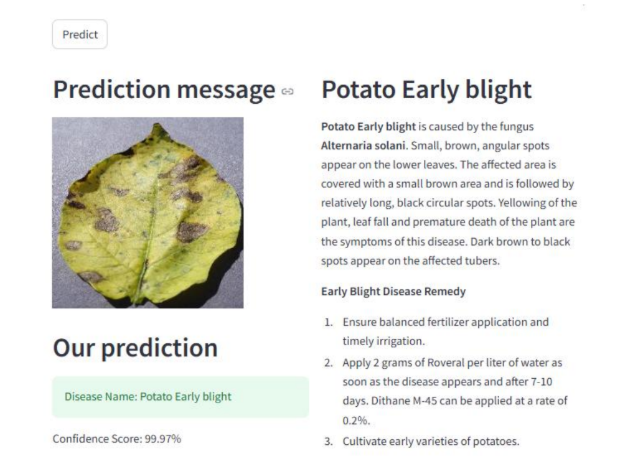
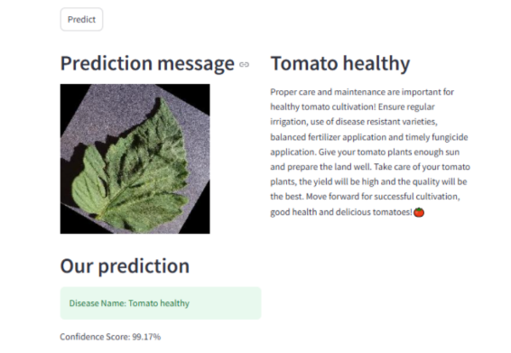

# 🌿 HarvestGuard Crop System

A machine learning–powered crop disease detection system built using a **Convolutional Neural Network (CNN)** in **Python**. The project was developed as a **final year thesis** at Sonargaon University and runs on **localhost** due to the large dataset size (2GB+). It analyzes leaf images to detect plant diseases and suggests proper treatment.

---

## 📌 Project Overview

HarvestGuard allows users to:

- Upload a photo of a plant leaf
- Use a trained CNN model to classify the disease
- Display recommended treatment on a web interface
- Run locally without a database

This is an academic project focused on practical machine learning and deep learning application.

---

## 🧠 Technologies Used

- **Python 3.12**
- **TensorFlow 2.16.1**
- **Keras 3.5.0**
- **CNN (Convolutional Neural Network)**
- **Jupyter Notebook**
- **OpenCV**

---

## ⚙️ Setup Instructions (Anaconda)

Follow these steps to set up and run the project in a clean Anaconda environment:

```bash
# 1. Create a new conda environment with Python 3.12.4
conda create --name tensorflow python=3.12.4

# 2. Activate the environment
conda activate tensorflow

# 3. Upgrade pip
python.exe -m pip install --upgrade pip

# 4. Install TensorFlow 2.16.1
pip install tensorflow==2.16.1

# 5. Install GPU support (optional)
conda install -c conda-forge cudatoolkit=11.2 cudnn=8.1.0

# 6. Install Keras
pip install keras==3.5.0

# 7. Install Jupyter Notebook
conda install anaconda::jupyter

# 8. Fix charset-normalizer error (if it occurs)
conda install -c conda-forge charset-normalizer

# 9. Launch Jupyter Notebook
jupyter notebook

```

🚀 How to Run

# Clone the repository

```
git clone https://github.com/yourusername/harvestguard-crop-system.git

```

# Navigate into the project folder

```
cd harvestguard-crop-system

```

## 🖼️ Screenshot




## ✅ Features

. Upload leaf images for instant disease prediction
. Custom-trained CNN model for classification
. Treatment suggestions based on prediction
. Simple UI for demonstration
. No internet required (runs locally)
. Easy to run in Jupyter Notebook

## ❗ Limitations

. Not deployed online due to large dataset size (2GB+)
. No database used (no data is stored)
. Predictions limited to the diseases in the training dataset
. Runs only on local machine (localhost)
